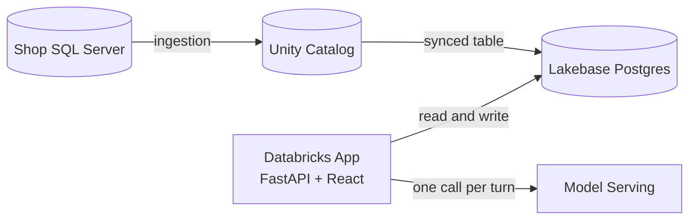

## The problem

A small shop owner carries a few hundred product lines and holds the whole stock position in their head. Milk turns over in two days, atta in five, and a box of chocolate can sit on the shelf for a quarter without anyone noticing. Ordering decisions get made from memory, usually while serving a customer.

Two failures follow, and both cost money quietly.

Stockouts happen when a fast mover runs down inside its supplier lead time. The shelf sits empty, the customer buys elsewhere, and the sale is gone rather than delayed.

Dead stock happens in the opposite direction. Capital sits on a shelf in the form of goods nobody is buying, and perishables reach their expiry date before they reach a customer.

Neither problem is hard to see once the data is in front of you. The difficulty is that the data lives in a till system nobody opens, in a stock register, and in the owner's memory, and none of those three agree with each other.

## What this application does

Shop Owner Assistant brings the stock position into one screen and puts an assistant next to it that can explain the position in plain language.

The dashboard shows current stock, days of cover against supplier lead time, sales, revenue, and upcoming expiry. Every number is computed in SQL, so the screen and the assistant always quote the same figure.

The stock request page lets the owner select products, set quantities, and submit a request. Requests are recorded with their origin, so a request that began as an assistant suggestion is distinguishable from one the owner raised alone.

The assistant answers questions such as what needs ordering today, what has stopped selling, and what expires this week. It reads the same computed stock position the dashboard reads, and it proposes actions rather than taking them.

## Design principles

These constraints shape every decision in the codebase.

### Numbers come from SQL, words come from the model

Days of cover, suggested order quantity, and slow-mover thresholds are computed by database views. The language model reads those values and explains them. It never calculates. This keeps every figure reproducible and auditable, and it removes the risk of a model quoting arithmetic it invented.

### The model proposes, a human decides

The assistant can recommend an order. It cannot write one. The owner approves through a button, and the application writes the row. The worst outcome of a bad suggestion is a suggestion the owner declines.

### One writer per table

Each table has exactly one system responsible for writing to it. Master product data flows in from the shop's existing system. Operational state belongs to the application. Shared write access produces silent overwrites that surface weeks later as unexplained numbers.

### One definition of every metric

Views wrap the metric logic, and both the dashboard and the assistant read those views. A screen that disagrees with the assistant destroys trust faster than a missing feature, and there is no way for the owner to tell which one is right.

### The dashboard never depends on the model

Stock, sales, and expiry render without calling model serving. If the assistant is unavailable, the owner still has their numbers. The optional feature never takes the core feature down with it.

## Architecture

Unity Catalog holds the governed history and is where ingestion lands. Lakebase holds the operational data the application reads and writes on every request. Splitting them follows the shape of the work: analytical scans over months of sales suit a column store, while single-row reads and writes suit a row store.

The application queries Lakebase only. Nothing in the request path waits for a warehouse to start.

### Application shape

One deployment serves both halves. FastAPI exposes the JSON API under `/api` and serves the compiled React bundle from every other path, which keeps the browser on a single origin and removes cross-origin configuration entirely.

| Layer | Responsibility |
|-------|----------------|
| React | Renders the dashboard, the request form, and the assistant panel |
| FastAPI | Serves the frontend, exposes the API, and enforces the response contract |
| Lakebase | Stores stock, sales, requests, and conversations |
| Unity Catalog | Governs master data and retains history |
| Model Serving | Turns computed numbers into an explanation |

## Data model

Shop data covers products, stock on hand, and daily sales. Application state covers conversations, messages, stock requests, request lines, and recorded actions.

Metric logic lives in database views rather than application code, which is what allows the dashboard and the assistant to agree by construction rather than by discipline.

## Future scope

The current build serves one shop. The interesting problems begin when the same data covers many.

### From reordering to replenishment

Suggested order quantity today reflects recent sales and supplier lead time. Adding seasonality, festival demand, and weather sensitivity turns a reactive reorder point into a forecast, letting stock arrive ahead of demand rather than in response to a shortage.

### Stock balancing across outlets

An owner running several shops has dead stock in one and a stockout of the same product in another. Comparing stock positions across outlets identifies transfers that clear slow-moving inventory without a purchase, which is the cheapest possible way to fix a shortage.

### Expiry-driven redistribution

Perishables approaching expiry in a low-footfall outlet can be moved to a high-footfall one while they still have shelf life. The signal already exists in the expiry and velocity data. Acting on it converts predictable write-offs into sales.

### Supplier and purchase order integration

Approved requests currently stop at the application boundary. Sending them directly to suppliers, and receiving confirmations and dispatch updates back, closes the loop between deciding to order and knowing when stock arrives.

### Order consolidation and route planning

Freight economics favour fewer, fuller deliveries. Once several shops share a distributor, their approved requests can be batched into consolidated orders and sequenced into delivery routes. The optimisation problem is genuinely a logistics one: minimise trips and distance while respecting lead times, vehicle capacity, and the cold chain for perishables.

### Supplier reliability scoring

Lead time is treated as a fixed number per product today. Measuring actual delivery performance against promised dates produces a reliability score per supplier, which feeds back into safety stock. An unreliable supplier should require more buffer than a dependable one, and that adjustment can be automatic.

## Status

The data layer is in place and the application is deployed. Metric views, persistence for requests and conversations, and the assistant integration are in progress.
